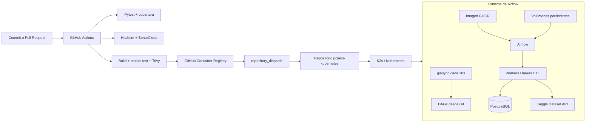

# Aplicación de Datos — Arquitectura y Flujo de Entrega

Repositorio: `polaris-airflow`

## Alcance de este repositorio

Este repositorio no aprovisiona AWS ni administra directamente el clúster Kubernetes. Concentra cuatro responsabilidades:

1. **Empaquetar la aplicación**: construir una imagen basada en `apache/airflow:3.2.2` con las dependencias Python, el código ETL y el SQL del modelo.
2. **Definir la orquestación**: mantener el DAG `olist_etl_pipeline` y su secuencia de extracción, transformación, modelado y carga.
3. **Validar el cambio**: ejecutar pruebas dinámicas, cobertura, Hadolint, smoke tests de la imagen, Trivy y SonarCloud.
4. **Entregar el artefacto**: publicar la imagen en GHCR con el SHA del commit y `latest`, y disparar un evento en el repositorio `polaris-kubernetes`.

Los DAGs **no se empaquetan dentro de la imagen** — Kubernetes los obtiene desde Git mediante Git-Sync, con sincronización configurada en la plataforma. Esto permite actualizar los workflows de forma independiente de la imagen de runtime.

## Diagrama de arquitectura



## Diseño intencionalmente desacoplado

- La **imagen** contiene el runtime y el código estable de soporte: dependencias, módulos ETL y SQL.
- Los **DAGs** se montan desde un volumen gestionado por Git-Sync, por lo que no dependen de una reconstrucción de imagen para cada cambio de orquestación.
- Los **datos temporales y procesados** se escriben en volúmenes montados por Kubernetes, no en el filesystem efímero del contenedor.
- La **infraestructura y el clúster** se gestionan en repositorios separados, con sus propios controles y ciclos de vida.

## Flujo de entrega en CI/CD

```
Checkout
  -> Hadolint
  -> Pytest + cobertura
  -> Build de imagen
  -> Smoke test de Airflow e imports
  -> Trivy sobre la imagen
  -> SonarCloud
  -> Publicación en GHCR [solo push a main]
  -> repository_dispatch a polaris-kubernetes
```

En `main`, la imagen se publica con dos tags: `<commit-sha>` (para despliegues reproducibles y trazables) y `latest` (referencia conveniente para desarrollo). El evento `deploy-airflow` incluye el SHA exacto de la imagen, que `polaris-kubernetes` usa para desplegar exactamente la versión aprobada por CI — nunca una versión ambigua o "la más reciente" sin trazabilidad.
