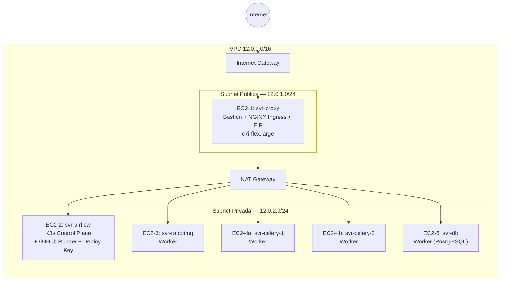

# Infraestructura — Arquitectura y Topología de Red

Repositorio: `polaris-infrastructure`

## Visión general

Este repositorio aprovisiona todos los recursos de AWS usando **Terraform** (Infraestructura como Código) y arranca un clúster **K3s** autoadministrado usando **Ansible** (Configuración como Código), incluyendo el registro automatizado de un GitHub Actions self-hosted runner y de un Deploy Key SSH para clonar el repositorio de la plataforma.

| Área | Herramienta |
|---|---|
| Cloud | AWS (us-east-1) |
| IaC | Terraform |
| CaC | Ansible |
| Orquestación | K3s (Kubernetes ligero) |
| CNI | Cilium (eBPF) |
| Ingress | NGINX Ingress |
| CI/CD self-hosted | GitHub Actions Runner (automatizado vía Ansible) |
| Calidad | TFLint, Checkov, Infracost, SonarCloud |
| CI/CD (infra) | GitHub Actions + OIDC |

## Topología de red

**Puntos clave de la topología:**

- Solo la instancia **proxy** tiene una IP pública (EIP) — el resto del clúster vive en subred privada, aislado de Internet.
- El tráfico saliente de la subred privada (por ejemplo, para descargar imágenes o paquetes) pasa por un **NAT Gateway**.
- `svr-airflow` cumple un doble rol: es el **control plane de K3s** y, adicionalmente, el nodo donde corren el **GitHub Actions self-hosted runner** y el clon del repositorio de plataforma vía Deploy Key — ambos configurados automáticamente por Ansible.

## Inventario de instancias

| Instancia | Host | Función | Subnet | Rol K8s |
|---|---|---|---|---|
| EC2-1 | svr-proxy | Bastión + controlador NGINX Ingress | Pública | — |
| EC2-2 | svr-airflow | Plano de control K3s + Airflow + GitHub Runner | Privada | Control plane |
| EC2-3 | svr-rabbitmq | Broker de mensajería RabbitMQ | Privada | Worker |
| EC2-4 (×2) | svr-celery-1, svr-celery-2 | Workers Celery | Privada | Worker |
| EC2-5 | svr-db | Base de datos PostgreSQL | Privada | Worker |

Todas las instancias comparten configuración base: tipo `c7i-flex.large`, **IMDSv2 forzado**, y volúmenes EBS **gp3 encriptados**.

## Estado de Terraform

El estado se administra remotamente en S3 con encriptación AES-256, separado del código de infraestructura de otros proyectos del portafolio (comparte cuenta de AWS, key distinta por proyecto).
